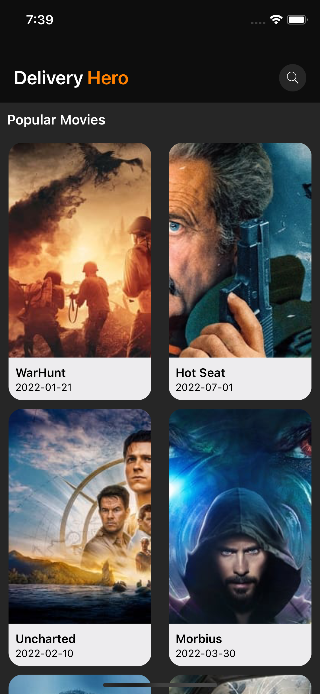
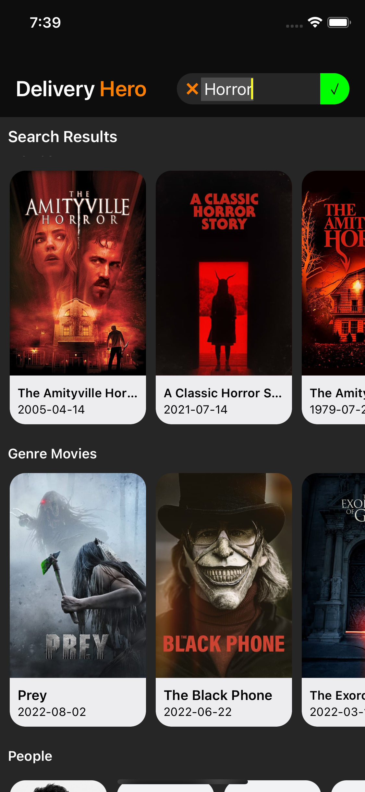
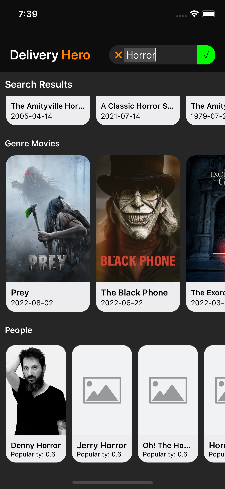
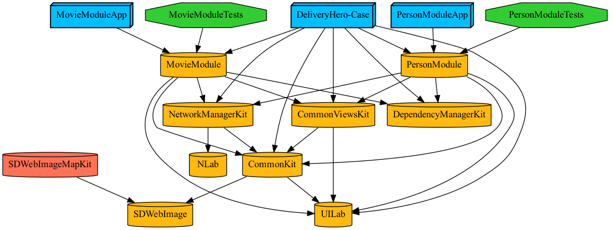

# DeliveryHero-Case

## Tech Stack

- Xcode Version: 14 beta
- iOS Version: iOS 11
- Third-party Dependencies: SDWebImage, UILab, NLab
- [Tuist](https://tuist.io) Version: 3.8.0
- VIPER
- Unit Tests

### Installation 
In the project folder run this command to install tuist, fetch dependencies and generate xcodeproj files. 
```bash
curl -Ls https://install.tuist.io | bash && tuist fetch && tuist generate
```

### Screenshots
| 1 | 2 | 3 |
|---|--|--|
|  |  |  |


### Dependency Graph


